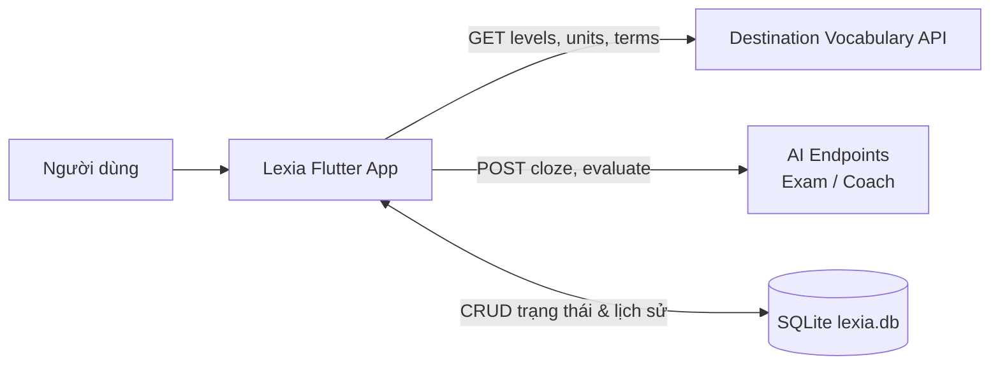
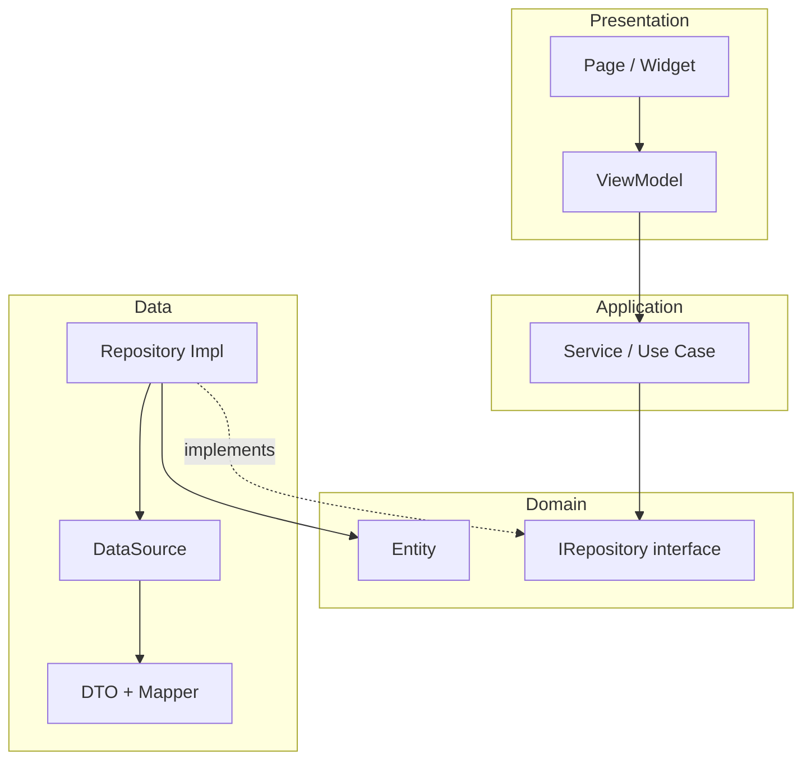
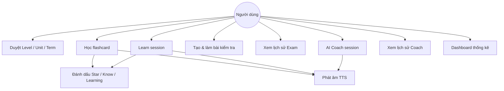
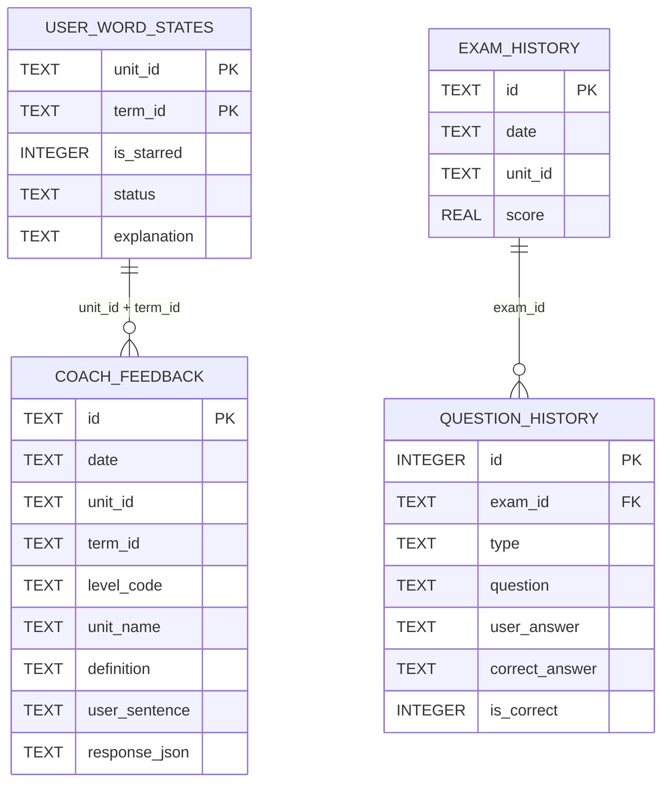
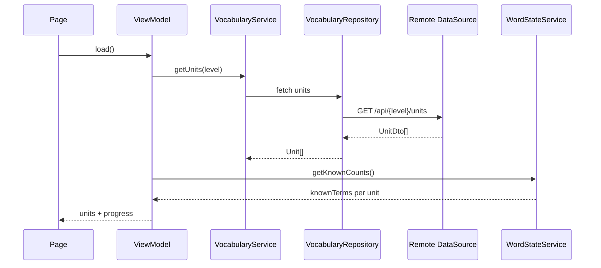
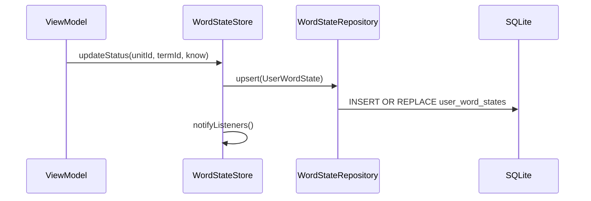
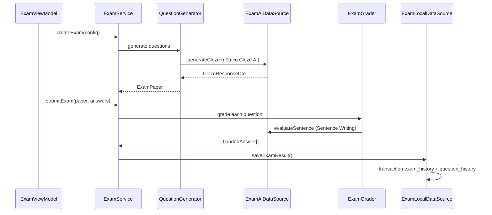

# Báo cáo kỹ thuật — Lexia

**Dự án:** Ứng dụng học từ vựng Destination (Flutter)  
**Phiên bản:** 1.0.0+1  
**Ngày báo cáo:** 03/07/2026

---

## Mục lục

1. [Tổng quan dự án](#1-tổng-quan-dự-án)
2. [Mục tiêu và phạm vi](#2-mục-tiêu-và-phạm-vi)
3. [Kiến trúc hệ thống](#3-kiến-trúc-hệ-thống)
4. [Công nghệ sử dụng](#4-công-nghệ-sử-dụng)
5. [Use case và chức năng](#5-use-case-và-chức-năng)
6. [Mô hình dữ liệu (ERD)](#6-mô-hình-dữ-liệu-erd)
7. [Tích hợp API](#7-tích-hợp-api)
8. [Luồng dữ liệu](#8-luồng-dữ-liệu)
9. [Điều hướng (Navigation)](#9-điều-hướng-navigation)
10. [Quy tắc nghiệp vụ](#10-quy-tắc-nghiệp-vụ)
11. [Kiểm thử](#11-kiểm-thử)
12. [Tiến độ triển khai](#12-tiến-độ-triển-khai)
13. [Hạn chế và hướng phát triển](#13-hạn-chế-và-hướng-phát-triển)

---

## 1. Tổng quan dự án

**Lexia** là ứng dụng client Flutter hỗ trợ học từ vựng theo bộ sách *Destination*. Ứng dụng lấy dữ liệu từ vựng (Level → Unit → Term) từ REST API có sẵn, đồng thời lưu toàn bộ trạng thái học tập, lịch sử bài kiểm tra và phản hồi AI Coach trên thiết bị (SQLite).

Ứng dụng **không yêu cầu đăng nhập**, **không đồng bộ đám mây** — phù hợp mô hình học offline-first với dữ liệu từ vựng online.

### Vai trò hệ thống



---

## 2. Mục tiêu và phạm vi

### 2.1 Mục tiêu

| Mục tiêu | Mô tả |
|----------|-------|
| Học từ vựng hiệu quả | Flashcard, chế độ Learn toàn màn hình, đánh dấu trạng thái từ |
| Kiểm tra năng lực | Tạo bài kiểm tra tùy chỉnh với 7 loại câu hỏi |
| Luyện viết câu | AI Coach đánh giá ngữ pháp, từ vựng, độ tự nhiên |
| Theo dõi tiến độ | Dashboard thống kê theo level, unit, exam, coach |

### 2.2 Phạm vi dữ liệu từ vựng

| Level | Mô tả |
|-------|-------|
| B1 | Trình độ trung cấp thấp |
| B2 | Trình độ trung cấp |
| C1&C2 | Trình độ cao cấp |

Mỗi level chứa nhiều **Unit**, mỗi unit chứa danh sách **Term** (từ + định nghĩa).

### 2.3 Ngoài phạm vi

- Xác thực người dùng / đồng bộ đa thiết bị
- Kiểm tra / làm sạch dữ liệu trả về từ API (theo BR-01, BR-02, BR-03)
- Streak, heatmap (theo spec §9)

---

## 3. Kiến trúc hệ thống

### 3.1 Mô hình kiến trúc: MVVM theo feature

Dự án áp dụng **MVVM (Model–View–ViewModel)** kết hợp **Clean Architecture** chia theo từng feature, tuân thủ quy ước khóa học.

```
lib/
├── app/          # App shell, Navigator 2.0, Dependency Injection
├── core/         # Hạ tầng dùng chung (network, database, theme, TTS, widgets)
├── shared/       # Module dùng chung giữa các feature (vocabulary API, word state)
└── features/     # home, learning, exam, coach, dashboard
```

### 3.2 Cấu trúc 4 lớp trong mỗi feature

| Lớp | Trách nhiệm | Ví dụ |
|-----|-------------|-------|
| **presentation** | UI (Page) + ViewModel (`ChangeNotifier`) | `LevelListPage`, `LevelListViewModel` |
| **application** | Use case / Service | `IExamService`, `ExamServiceImpl` |
| **domain** | Entity + Repository contract | `ExamResult`, `IExamRepository` |
| **data** | DTO, Mapper, DataSource, Repository impl | `ExamLocalDataSourceImpl`, `ExamAiDataSourceImpl` |

### 3.3 Sơ đồ phụ thuộc giữa các lớp



### 3.4 Quy tắc kiến trúc

| Quy tắc | Mô tả |
|---------|-------|
| Page không gọi API trực tiếp | Mọi tương tác dữ liệu đi qua ViewModel → Service → Repository |
| ViewModel không dùng DTO | Chỉ làm việc với domain entity |
| Interface + Implementation | Mọi Service / Repository đều tách interface và impl |
| Cô lập feature | Không import `data/` của feature khác |
| DI tập trung | Đăng ký dependency trong `app/di/injection.dart` qua `get_it` |

### 3.5 Dependency Injection

Tất cả dependency được đăng ký tại `lib/app/di/injection.dart`:

- **Singleton:** `Dio`, `AppDatabase`, `ITtsService`, các Repository/Service
- **Khởi tạo:** `setupDependencies()` được gọi trong `main()` trước `runApp()`

---

## 4. Công nghệ sử dụng

| Thành phần | Công nghệ | Phiên bản / Ghi chú |
|------------|-----------|---------------------|
| Framework | Flutter | SDK ^3.11.0 |
| State management | `provider` + `ChangeNotifier` | ViewModel pattern |
| DI | `get_it` | ^8.0.3 |
| HTTP client | `dio` | ^5.8.0 |
| Local database | `sqflite` + FFI | `lexia.db`, schema v5 |
| Navigation | Navigator 2.0 | `RouterDelegate` + `RouteInformationParser` |
| Text-to-Speech | `flutter_tts` | Đọc term qua `ITtsService` |
| Typography | `google_fonts` | Theme tùy chỉnh |
| Nền tảng | Android, Windows, Linux, macOS, Web | Desktop dùng `sqflite_common_ffi` |

---

## 5. Use case và chức năng

### 5.1 Sơ đồ use case tổng quan



### 5.2 Chi tiết use case theo module

#### UC-01: Duyệt từ vựng (Home)

| Thuộc tính | Nội dung |
|------------|----------|
| **Actor** | Người dùng |
| **Mô tả** | Duyệt cấu trúc Level → Unit → Term, xem tiến độ học |
| **Luồng chính** | Chọn tab Home → Level List → Unit List → Term List |
| **Chức năng phụ** | Tìm kiếm realtime, sắp xếp (Original / A-Z / Z-A), lọc term (All / Starred / Learning / Known) |
| **Module** | `features/home`, `shared/vocabulary`, `shared/word_state` |
| **Trạng thái** | ✅ Hoàn thành |

**Term List** hỗ trợ 2 chế độ hiển thị:
- **Mode 1:** Danh sách Quizlet-style (term + definition cùng hàng)
- **Mode 2:** Flashcard (một mặt, tap để lật)

#### UC-02: Học flashcard (Learn)

| Thuộc tính | Nội dung |
|------------|----------|
| **Actor** | Người dùng |
| **Mô tả** | Phiên học toàn màn hình với gesture swipe |
| **Luồng chính** | Term List → Learn → Swipe trái (Know) / phải (Learning) |
| **Quy tắc session** | Từ Learning xuất hiện lại sau vòng đầu; session kết thúc khi tất cả term ở trạng thái Know |
| **Chức năng phụ** | Undo, Shuffle, TTS, Star |
| **Module** | `features/learning` |
| **Trạng thái** | ✅ Hoàn thành |

#### UC-03: Tạo và làm bài kiểm tra (Exam)

| Thuộc tính | Nội dung |
|------------|----------|
| **Actor** | Người dùng |
| **Mô tả** | Cấu hình và làm bài kiểm tra từ vựng |
| **Cấu hình** | Level, Unit (hoặc All), Star only, số câu (10/20/50/100), loại câu hỏi |
| **Loại câu hỏi** | Term→Definition, Definition→Term, Cloze AI, Matching, EN→VI, EN→EN, Sentence Writing AI |
| **Kết quả** | Điểm %, review đáp án đúng/sai, lưu lịch sử |
| **Module** | `features/exam` |
| **Trạng thái** | ✅ Hoàn thành |

#### UC-04: Lịch sử bài kiểm tra (Exam History)

| Thuộc tính | Nội dung |
|------------|----------|
| **Actor** | Người dùng |
| **Mô tả** | Xem danh sách bài đã làm, chi tiết từng câu, xóa bài |
| **Dữ liệu lưu** | Ngày, unit, điểm, danh sách câu hỏi + đáp án người dùng + đáp án đúng |
| **Module** | `features/exam` |
| **Trạng thái** | ✅ Hoàn thành |

#### UC-05: AI Coach

| Thuộc tính | Nội dung |
|------------|----------|
| **Actor** | Người dùng |
| **Mô tả** | Luyện viết câu tiếng Anh với từ mục tiêu, nhận phản hồi AI |
| **Cấu hình** | 5 / 10 / 20 từ, lọc theo star, chọn level/unit |
| **Phản hồi** | Grammar, Vocabulary, Naturalness, Suggestion (không chấm điểm số) |
| **Giải thích từ** | API explain trả về usage, contexts, examples |
| **Module** | `features/coach` |
| **Trạng thái** | ✅ Hoàn thành |

#### UC-06: Lịch sử Coach

| Thuộc tính | Nội dung |
|------------|----------|
| **Actor** | Người dùng |
| **Mô tả** | Xem từ đã được coach, chi tiết từng lần phản hồi, xóa |
| **Module** | `features/coach` |
| **Trạng thái** | ✅ Hoàn thành |

#### UC-07: Dashboard

| Thuộc tính | Nội dung |
|------------|----------|
| **Actor** | Người dùng |
| **Mô tả** | Tổng quan tiến độ học tập |
| **Thống kê** | Overall progress, learned/learning/starred words, progress theo level, exam count, average score, strongest/weakest units, recent exams & coach |
| **Module** | `features/dashboard` |
| **Trạng thái** | ✅ Hoàn thành |

#### UC-08: Quản lý trạng thái từ (Word State)

| Thuộc tính | Nội dung |
|------------|----------|
| **Actor** | Hệ thống (triggered bởi người dùng) |
| **Mô tả** | Lưu trạng thái Star, Know, Learning theo từng unit |
| **Trạng thái** | `new` → `learning` → `know` |
| **Module** | `shared/word_state` |
| **Trạng thái** | ✅ Hoàn thành |

---

## 6. Mô hình dữ liệu (ERD)

### 6.1 Dữ liệu từ API (không lưu local)

Dữ liệu từ vựng được fetch realtime từ API, map sang domain entity:

```
Level (code, totalTerms*, knownTerms*)
  └── Unit (id, name, totalTerms*, knownTerms*)
        └── Term (id, text, definition)
```

\* `knownTerms` và `progress` được tính từ `user_word_states` local, không lưu trong API.

### 6.2 ERD cơ sở dữ liệu local (SQLite)

File: `lexia.db` — Schema version **5**



### 6.3 Mô tả bảng

#### `user_word_states`

| Cột | Kiểu | Mô tả |
|-----|------|-------|
| `unit_id` | TEXT | Khóa chính (composite) — định danh unit |
| `term_id` | TEXT | Khóa chính (composite) — định danh term |
| `is_starred` | INTEGER | 0/1 — đánh dấu sao |
| `status` | TEXT | `new` / `learning` / `know` |
| `explanation` | TEXT | Giải thích từ từ Coach (nullable) |

#### `exam_history`

| Cột | Kiểu | Mô tả |
|-----|------|-------|
| `id` | TEXT | UUID bài kiểm tra |
| `date` | TEXT | ISO 8601 timestamp |
| `unit_id` | TEXT | JSON `{id, label}` của unit |
| `score` | REAL | Phần trăm điểm (0–100) |

#### `question_history`

| Cột | Kiểu | Mô tả |
|-----|------|-------|
| `id` | INTEGER | Auto increment |
| `exam_id` | TEXT | FK → `exam_history.id` |
| `type` | TEXT | Storage key loại câu hỏi |
| `question` | TEXT | JSON payload câu hỏi |
| `user_answer` | TEXT | Đáp án người dùng |
| `correct_answer` | TEXT | Đáp án đúng (text) |
| `is_correct` | INTEGER | 0/1 |

#### `coach_feedback`

| Cột | Kiểu | Mô tả |
|-----|------|-------|
| `id` | TEXT | UUID feedback entry |
| `date` | TEXT | ISO 8601 timestamp |
| `unit_id` | TEXT | Định danh unit |
| `term_id` | TEXT | Từ mục tiêu |
| `level_code` | TEXT | Mã level (B1, B2, …) |
| `unit_name` | TEXT | Tên unit hiển thị |
| `definition` | TEXT | Định nghĩa tại thời điểm coach |
| `user_sentence` | TEXT | Câu người dùng viết |
| `response_json` | TEXT | JSON phản hồi AI (grammar, vocabulary, …) |

### 6.4 Enum và entity domain chính

**WordStatus** (`shared/word_state`):

| Giá trị | Ý nghĩa |
|---------|---------|
| `newWord` | Chưa học |
| `learning` | Đang học |
| `know` | Đã thuộc |

**ExamQuestionType** (`features/exam`):

| Loại | AI-powered |
|------|------------|
| Term → Definition | Không |
| Definition → Term | Không |
| Cloze AI | Có |
| Matching | Không |
| English → Vietnamese | Không (synonym local) |
| English → English | Không |
| Sentence Writing AI | Có |

---

## 7. Tích hợp API

**Base URL:** `https://destination-vocabulary-api.onrender.com`

### 7.1 Vocabulary API

| Method | Endpoint | Mục đích |
|--------|----------|----------|
| GET | `/api` | Danh sách levels |
| GET | `/api/{level}/units` | Units theo level |
| GET | `/api/{level}/units/{unit_name}` | Terms trong unit |

### 7.2 AI — Exam

| Method | Endpoint | Mục đích |
|--------|----------|----------|
| POST | `/api/exam/cloze` | Sinh câu điền khuyết AI |
| POST | `/api/exam/evaluate-sentence` | Chấm câu viết (Sentence Writing) |

### 7.3 AI — Coach

| Method | Endpoint | Mục đích |
|--------|----------|----------|
| POST | `/api/coach/explain` | Giải thích cách dùng từ |
| POST | `/api/coach/evaluate` | Đánh giá câu người dùng viết |

### 7.4 Xử lý lỗi mạng

- `DioClient` cấu hình timeout và interceptor
- `messageFromDioException()` chuẩn hóa thông báo lỗi (429 quota, timeout, …)
- Exam Sentence Writing có fallback khi AI không khả dụng

---

## 8. Luồng dữ liệu

### 8.1 Luồng đọc từ vựng



### 8.2 Luồng cập nhật trạng thái từ



### 8.3 Luồng làm bài kiểm tra



---

## 9. Điều hướng (Navigation)

### 9.1 Bottom Navigation (4 tab)

| Tab | Màn hình gốc |
|-----|--------------|
| Home | Level List |
| Dashboard | Dashboard |
| Exam History | Danh sách bài kiểm tra |
| Coach History | Danh sách từ đã coach |

### 9.2 Home stack (nested Navigator)

```
Level List → Unit List → Term List → Learn / Exam Config / Coach Config
```

### 9.3 Cơ chế điều hướng

- **Navigator 2.0:** `AppRouterDelegate` + `AppRouteInformationParser`
- **State:** `AppNavigationNotifier` (ChangeNotifier) — Pages gọi qua `context.read<AppNavigationNotifier>()`
- **Không** dùng `Navigator.push` trực tiếp từ Pages (trừ nested navigator nội bộ)

---

## 10. Quy tắc nghiệp vụ

| ID | Quy tắc |
|----|---------|
| BR-01 | Ứng dụng không kiểm tra dữ liệu trả về từ API |
| BR-02 | Không xử lý term trùng lặp |
| BR-03 | Không xử lý definition sai format |
| BR-04 | Mọi trạng thái học tập lưu cục bộ (SQLite) |
| BR-05 | Không yêu cầu đăng nhập |
| BR-06 | Star, Know, Learning quản lý độc lập theo từng Unit |
| BR-07 | Progress = số từ có trạng thái Know / tổng số từ |

---

## 11. Kiểm thử

### 11.1 Cấu trúc test

```
test/
├── core/network/dio_error_message_test.dart
├── features/
│   ├── dashboard/data/dashboard_local_data_source_test.dart
│   ├── exam/exam_grader_test.dart
│   └── learning/learn_session_test.dart
├── shared/word_state/word_state_persistence_test.dart
└── widget_test.dart
```

### 11.2 Phạm vi kiểm thử

| Test file | Nội dung kiểm tra |
|-----------|-------------------|
| `learn_session_test.dart` | Quy tắc session Learn (spec §6): queue, Learning reappear, undo, shuffle |
| `word_state_persistence_test.dart` | Trạng thái từ persist qua reopen DB, star độc lập status |
| `exam_grader_test.dart` | Logic chấm điểm multiple choice, matching, synonym |
| `dio_error_message_test.dart` | Thông báo lỗi API 429, timeout |
| `dashboard_local_data_source_test.dart` | Query recent coach từ `coach_feedback` |
| `widget_test.dart` | Smoke test app khởi động |

### 11.3 Chạy test

```bash
flutter test
```

---

## 12. Tiến độ triển khai

### 12.1 Bảng tổng hợp

| Module | Chức năng chính | Trạng thái |
|--------|-----------------|------------|
| **app** | Shell, DI, Navigator 2.0 | ✅ Hoàn thành |
| **core** | Database, Network, Theme, TTS, Widgets | ✅ Hoàn thành |
| **shared/vocabulary** | Fetch Level/Unit/Term từ API | ✅ Hoàn thành |
| **shared/word_state** | Star / Know / Learning local | ✅ Hoàn thành |
| **home** | Level/Unit/Term list, search, sort, filter, 2 display modes | ✅ Hoàn thành |
| **learning** | Full-screen session, swipe, undo, shuffle | ✅ Hoàn thành |
| **exam** | Config, 7 loại câu hỏi, chấm điểm, result, history | ✅ Hoàn thành |
| **coach** | Config, explain, evaluate, history, detail | ✅ Hoàn thành |
| **dashboard** | Thống kê tổng hợp, recent items | ✅ Hoàn thành |

### 12.2 Thống kê mã nguồn

| Hạng mục | Số lượng (ước lượng) |
|----------|----------------------|
| File Dart trong `lib/` | ~122 file |
| Feature modules | 5 (home, learning, exam, coach, dashboard) |
| Shared modules | 2 (vocabulary, word_state) |
| SQLite schema version | 5 |
| Unit / widget tests | 6 file test |

### 12.3 Mức độ hoàn thiện theo spec

Tham chiếu đầy đủ: [docs/specs.md](docs/specs.md)

| Phần spec | Hoàn thành |
|-----------|------------|
| §2 Navigation | ✅ |
| §3 Home / Create Exam | ✅ |
| §4 Unit List | ✅ |
| §5 Term List (2 modes) | ✅ |
| §6 Learn Module | ✅ |
| §7 Exam Module | ✅ |
| §8 AI Coach | ✅ |
| §9 Dashboard | ✅ |
| §10–12 Search, Sort, Audio | ✅ |
| §13 Local Data | ✅ |
| §14 Non-functional | ✅ (trừ responsive đa kích thước màn hình — cần đánh giá thêm) |

---

## 13. Hạn chế và hướng phát triển

### 13.1 Hạn chế hiện tại

| Hạn chế | Mô tả |
|---------|-------|
| Không offline vocabulary | Cần mạng để tải Level/Unit/Term |
| Không đồng bộ | Đổi thiết bị = mất tiến độ |
| Phụ thuộc AI API | Cloze, Sentence Writing, Coach cần backend AI hoạt động |
| Không validate API data | Term trùng, definition lỗi format không được xử lý |
| EN→VI grading | Chỉ so khớp synonym local, chưa gọi AI khi không khớp (spec §7.2 gợi ý AI fallback) |

### 13.2 Hướng phát triển

1. **Đồng bộ đám mây** — Tài khoản người dùng + sync `user_word_states`
2. **Cache vocabulary** — Lưu term local để học offline
3. **Cải thiện test** — Widget test mock TTS, integration test end-to-end
4. **Accessibility** — Hỗ trợ screen reader, font scaling
5. **i18n** — Giao diện đa ngôn ngữ (hiện UI tiếng Anh)

---

## Tài liệu tham khảo

| Tài liệu | Đường dẫn |
|----------|-----------|
| Software Requirement Specification | [docs/specs.md](docs/specs.md) |
| README dự án | [README.md](README.md) |
| Vocabulary API docs | https://destination-vocabulary-api.onrender.com/docs |
